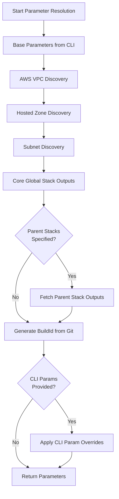
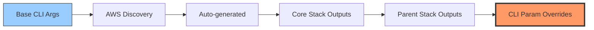
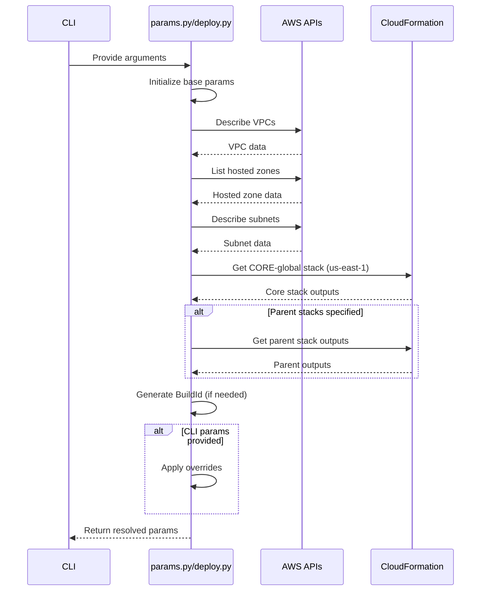

# Parameter Resolution in CloudFormation Deployment

## Overview
This document describes how parameters are resolved for CloudFormation deployments across the deployment pipeline tools.

## Tools

### params.py
Standalone parameter resolver that gathers baseline parameters without deploying.

**Output Formats:**
- `pretty` (default): Structured display with categories and missing parameter detection
- `json`: JSON format for programmatic use
- `text`: KEY=VALUE pairs for shell scripts

**Usage as CLI:**
```bash
# Pretty formatted output (default)
python shared/params.py --aws-account-id 123 --aws-region us-east-1 ...

# JSON output for scripting
python shared/params.py --aws-account-id 123 --aws-region us-east-1 ... --output json

# Quiet mode (suppress progress messages)
python shared/params.py --aws-account-id 123 --aws-region us-east-1 ... --quiet
```

**Usage as module:**
```python
from shared.params import resolve_baseline_params
params = resolve_baseline_params(...)
```

### deploy.py
Full CloudFormation deployment script with parameter resolution and template rendering.

### render.py
Jinja2 template rendering with parameter substitution.

---

## Parameter Resolution Flow



---

## Parameter Precedence Rules

Parameters are resolved in order, with later sources overriding earlier ones:



**Priority (Highest to Lowest):**
1. **CLI Parameter Overrides** (`--param KEY=VALUE`) - Highest priority
2. **Parent Stack Outputs** (from specified parent stacks)
3. **Core Global Stack Outputs** (from us-east-1 CORE-global stack)
4. **Auto-generated Values** (BuildId from git)
5. **AWS Infrastructure Discovery** (VPC, Subnets, Hosted Zones)
6. **Base CLI Arguments** (AccountId, Region, ProjectName, etc.)

---

## Parameter Sources

| Source | Examples | When Applied | Can Override |
|--------|----------|--------------|--------------|
| **CLI Arguments** | `AccountId`, `Region`, `ProjectName`, `EnvironmentName` | Always (required) | No (base values) |
| **AWS Discovery** | `VPCId`, `VPCCidr`, Subnet IDs by name, `PrivateHostedZoneId`, `PublicHostedZoneId` | When AWS resources exist | No |
| **Auto-generated** | `BuildId` (from git hash) | If not already in params | AWS Discovery |
| **Core Stack** | Global stack outputs (e.g., ACM certificates, shared resources) | If stack exists in us-east-1 | Auto-generated |
| **Parent Stacks** | Stack-specific outputs (e.g., network configs, database endpoints) | If `--parent-stacks` specified | Core Stack |
| **CLI Overrides** | Any `KEY=VALUE` from `--param` | If `--param` provided | Everything |

---

## Special Resolution Rules

### 1. VPC Data Discovery
- Searches for VPCs in the specified region
- If multiple VPCs found: Uses first VPC, logs warning
- If no VPCs found: Logs warning, continues with null values
- Returns: `VPCId`, `VPCCidr`

### 2. Hosted Zone Matching
- Searches Route53 for zones ending with `--hosted-zone` suffix
- Finds first public zone matching suffix
- Finds first private zone matching suffix
- Returns: `PublicHostedZoneName`, `PublicHostedZoneId`, `PrivateHostedZoneName`, `PrivateHostedZoneId`
- Logs warning if zones not found

### 3. Subnet Name Tag Mapping
- Fetches all subnets in the discovered VPC
- Maps subnet IDs by their `Name` tag
- Skips subnets without `Name` tag (logs warning)
- Returns: Dictionary with subnet name as key, subnet ID as value
- Example: `{"public-subnet-1a": "subnet-abc123", "private-subnet-1a": "subnet-def456"}`

### 4. BuildId Auto-generation
- Runs `git rev-parse --short HEAD` to get commit hash
- Only applied if `BuildId` not already in params
- If git fails: Logs warning, continues without BuildId

### 5. Stack Name Construction
- Format: `{PROJECT}-{ENV}-{STACK_NAME}`
- All uppercase, underscores replaced with hyphens
- Example: `MYPROJECT-DEV-CORE-global`
- Note: `params.py` does NOT construct stack names, only returns parameters

---

## Resolution Sequence Diagram



---

## Examples

### Example 1: Basic Resolution
```bash
python shared/params.py \
  --aws-account-id 123456789012 \
  --aws-region us-east-1 \
  --project-name myapp \
  --environment-name dev \
  --hosted-zone example.com
```

**Result:**
```json
{
  "AccountId": "123456789012",
  "Region": "us-east-1",
  "ProjectName": "myapp",
  "EnvironmentNameLower": "dev",
  "EnvironmentNameUpper": "DEV",
  "VPCId": "vpc-abc123",
  "VPCCidr": "10.0.0.0/16",
  "PublicHostedZoneName": "example.com",
  "PublicHostedZoneId": "Z1234567890ABC",
  "PrivateHostedZoneName": "internal.example.com",
  "PrivateHostedZoneId": "Z0987654321XYZ",
  "public-subnet-1a": "subnet-111",
  "private-subnet-1a": "subnet-222",
  "BuildId": "a1b2c3d"
}
```

### Example 2: With Parent Stacks
```bash
python shared/params.py \
  --aws-account-id 123456789012 \
  --aws-region us-east-1 \
  --project-name myapp \
  --environment-name dev \
  --hosted-zone example.com \
  --parent-stacks CORE-vpc,CORE-database
```

**Additional params from parent stacks:**
```json
{
  "DatabaseEndpoint": "db.example.com",
  "VPCSecurityGroupId": "sg-abc123",
  ...
}
```

### Example 3: With CLI Overrides
```bash
python shared/params.py \
  --aws-account-id 123456789012 \
  --aws-region us-east-1 \
  --project-name myapp \
  --environment-name dev \
  --hosted-zone example.com \
  --param BuildId=custom-build-123 \
  --param CustomParameter=CustomValue
```

**Result includes overrides:**
```json
{
  "BuildId": "custom-build-123",
  "CustomParameter": "CustomValue",
  ...
}
```

---

## Error Handling

### AWS Discovery Failures
- **VPC not found**: Warning logged, continues with `VPCId=None`, `VPCCidr=None`
- **Hosted zones not found**: Warning logged, continues with zone fields as `None`
- **Subnet discovery fails**: Warning logged, no subnet mappings added

### Stack Output Failures
- **Stack doesn't exist**: Warning logged, no outputs added
- **AWS API errors**: Exception raised, script fails

### Git Failures
- **Git not available**: Warning logged, `BuildId` not set (unless provided via `--param`)
- **Not a git repository**: Warning logged, `BuildId` not set

### CLI Parameter Errors
- **Invalid format**: Parameter ignored with warning (must be `KEY=VALUE`)
- **Missing required args**: Script fails with usage message

---

## Integration with Other Tools

### deploy.py
Uses same parameter resolution logic, then:
1. Reads CloudFormation template
2. Renders template with params (via `render.py`)
3. Deploys to CloudFormation
4. Retrieves deployed stack outputs

### render.py
Can use params from `params.py` output:
```bash
# Get params
python shared/params.py ... > /tmp/params.json

# Use in render.py (via --param)
python shared/render.py \
  --template-file template.yaml \
  --output-file rendered.yaml \
  --aws-region us-east-1 \
  --project-name myapp \
  --environment-name dev \
  --parent-stacks CORE-global \
  --param $(jq -r 'to_entries[] | "--param \(.key)=\(.value)"' /tmp/params.json)
```

### ext/deploy.sh
Shell script approach (parallel system), uses different mechanism:
- Fetches VPC/subnet data via AWS CLI
- Constructs params in bash
- Passes to Ansible
- Independent from Python tools

---

## Summary

**Key Points:**
- Parameters cascade from base → discovered → generated → stacks → overrides
- CLI params always win (highest priority)
- Parent stacks override core stack
- AWS discovery provides infrastructure context
- All warnings logged, script continues unless critical failure

**When to Use Each Tool:**
- **params.py**: Debug parameter resolution, validate before deploy
- **deploy.py**: Full deployment with parameter resolution
- **render.py**: Template rendering only
- **ext/deploy.sh**: Ansible-based deployment (alternative approach)
